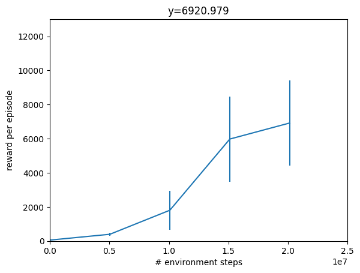
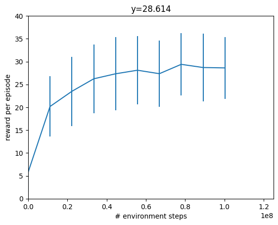
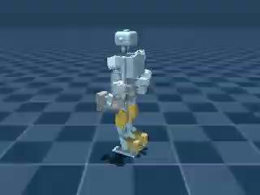
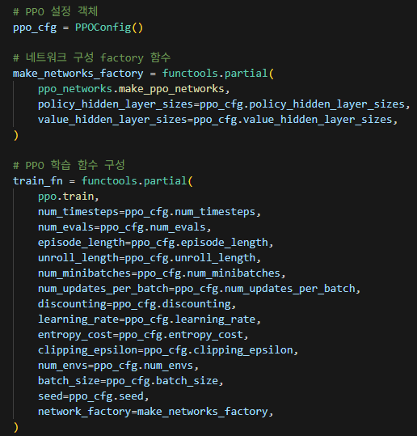

# Weekly Report 2025-07-15: ToddlerBot Simulation

| 항목 | 내용 |
|------|------|
| 작성일 | 2025년 7월 14일 |
| 발표자 | EunwooSong |
| 이메일 | song200348@gmail.com |

---

## 목차

본 리포트에서는 ToddlerBot 환경 설정 방법, Jupyter Notebook에서의 Mujoco 렌더링 예제, ToddlerBot 시뮬레이션 렌더링, Brax를 활용한 정책 학습, 그리고 Brax를 이용한 ToddlerBot 학습에 대하여 다루었다. 마지막으로 그래픽스 관련 내용을 추가하였다.

---

## 1. ToddlerBot 환경 설정 방법

본 섹션에서는 Ubuntu 24.04 환경에서 ToddlerBot 개발 환경을 구축하는 방법에 대하여 설명한다.

### 1.1 Mujoco210 설치

ToddlerBot 실행을 위해서는 먼저 Mujoco210을 설치해야 한다. 홈 디렉토리에서 Mujoco210 아카이브 파일을 다운로드하고 압축을 해제한 후, `.mujoco` 디렉토리에 복사하는 과정을 거친다. 구체적인 설치 명령어는 다음과 같다.

```bash
cd ~
wget https://github.com/google-deepmind/mujoco/releases/download/2.1.0/mujoco210-linux-x86_64.tar.gz
tar -zxvf mujoco210-linux-x86_64.tar.gz
rm -rf mujoco210-linux-x86_64.tar.gz
mkdir ~/.mujoco
cp -r mujoco210 ~/.mujoco/
```

### 1.2 Conda 가상환경 생성

다음 단계로 Conda 가상환경을 생성하여야 한다. 이 과정을 수행하기 위해서는 Github에 SSH key가 등록되어 있어야 한다. Python 3.10 버전을 기반으로 toddlerbot이라는 이름의 가상환경을 생성하고, 필요한 패키지들을 설치한다.

```bash
conda create --name toddlerbot python=3.10
conda activate toddlerbot
pip install -e toddlerbot/brax
pip install -e ".[linux]"
conda activate toddlerbot
```

### 1.3 환경변수 추가

LD_LIBRARY_PATH 환경변수를 설정하여야 Python 모듈이 Mujoco의 바이너리 파일을 찾을 수 있다. 다음과 같이 환경변수를 추가한다.

```bash
export LD_LIBRARY_PATH=$LD_LIBRARY_PATH:/home/{username}/.mujoco/mujoco210/bin33
```

### 1.4 ToddlerBot Cython 빌드 환경 설정

ToddlerBot의 Cython 빌드 환경을 구성하기 위해 필요한 패키지들을 설치한다. Github에 SSH key가 등록되어 있어야 하며, 다음 명령어를 실행한다.

```bash
conda install -c conda-forge libstdcxx-ng=12
pip install Cython==3.0.0a10
pip3 install -U 'mujoco-py<2.2,>=2.1'
```

### 1.5 MuJoCo 설치 테스트

MuJoCo가 정상적으로 설치되었는지 확인하기 위해 테스트 코드를 실행한다. mujoco_py 모듈을 임포트하고 humanoid 모델을 로드하여 시뮬레이션을 수행한다. 시뮬레이션 스텝 전후의 qpos 값을 출력하여 정상 동작 여부를 확인할 수 있다.

```python
import mujoco_py
import os
mj_path = mujoco_py.utils.discover_mujoco()
xml_path = os.path.join(mj_path, 'model', 'humanoid.xml')
model = mujoco_py.load_model_from_path(xml_path)
sim = mujoco_py.MjSim(model)
print(sim.data.qpos)
sim.step()
print(sim.data.qpos)
```

### 1.6 부록: Jupyter Notebook에 Conda 가상환경 커널 추가

Jupyter Notebook에서 생성한 Conda 가상환경을 사용하려면 커널을 추가해야 정상적으로 동작한다. 먼저 conda 환경을 활성화한 후, ipykernel을 설치하고, 해당 환경을 Jupyter 커널로 등록한다.

```bash
# Step 1. Activate conda environment
conda activate your_env_name

# Step 2. Install ipykernel in the environment
pip install ipykernel

# Step 3. Add the environment to Jupyter as a new kernel
python -m ipykernel install --user --name your_env_name --display-name "Python (your_env_name)"
```

---

## 2. Jupyter Notebook에서의 Mujoco 렌더링 예제

본 섹션에서는 Ubuntu 24.04 환경에서 Jupyter Notebook을 활용한 Mujoco 렌더링 방법에 대하여 설명한다.

### 2.1 Jupyter Notebook 사용 이유

CLI 환경에서는 실제 학습이 정상적으로 수행되는지 시각적으로 확인할 수 있는 방법이 제한적이다. Jupyter Notebook의 가상 display를 이용하면 학습 과정을 시각적으로 확인할 수 있을 것으로 판단하였다.

### 2.2 샘플 코드

Mujoco 환경을 렌더링하여 현재 shell의 display를 지우고 다시 plt를 출력하는 방식으로 시뮬레이션을 시각화한다. 다음은 환경 설치 테스트용 코드이다.

```python
import gym
from IPython import display
import matplotlib.pyplot as plt

env = gym.make('HalfCheetah-v3', render_mode="rgb_array")
observation = env.reset()
for _ in range(50):
   screen = env.render()
   display.clear_output(wait=True)
   display.display(plt.gcf())
   plt.imshow(screen)
   env.step(env.action_space.sample())
plt.close()
env.close()
```

### 2.3 샘플 코드 실행 결과

위 코드를 실행한 결과, Mujoco 환경이 정상적으로 렌더링되어 시각화되는 것을 확인하였다.


---

## 3. ToddlerBot 시뮬레이션 렌더링

본 섹션에서는 Ubuntu 24.04 환경에서 ToddlerBot 시뮬레이션을 렌더링하는 과정에서 발생한 문제점과 해결 방법에 대하여 설명한다.

### 3.1 문제점 개요

ToddlerBot 시뮬레이션 렌더링 과정에서 다음과 같은 문제들이 발생하였다. 첫째, ToddlerBot의 Mesh 및 XML 파일 위치에 대한 정보가 부족하였다. 둘째, 위 문제를 해결한 후에도 모듈에서 파일 경로를 찾을 수 없는 오류가 발생하였다. 셋째, GLFW 초기화 과정에서 Mujoco Renderer 초기화 오류가 발생하였다.

### 3.2 문제 1: ToddlerBot의 Mesh 및 XML 파일 위치

ToddlerBot의 Mesh 및 XML 파일들은 `toddlerbot/descriptions/assemblies/toddlerbot` 경로에 위치하며, 각 파츠별로 별도로 불러와 학습을 진행할 수 있다. 근본적인 원인을 분석한 결과, `bash onshape_to_robot.sh` 명령 실행 중 오류가 발생하여 기존에 있던 mesh, xml 등의 정보 파일이 삭제된 것을 확인하였다.


### 3.3 문제 2: toddlerbot 모듈의 경로 문제

파일을 불러오는 코드에서 os.path의 상대경로가 올바르게 동작하지 않는 문제가 발생하였다. 이를 해결하기 위해 `toddlerbot/descriptions/assemblies/` 경로를 pathlib를 이용하여 절대경로로 수정하였다.

```python
class Robot:
   """This class defines some data strucutres, FK, IK of ToddlerBot."""
   def __init__(self, robot_name: str):
       self.root_path = Path(__file__).parent.parent
       self.root_path = self.root_path / "descriptions" / self.name
       self.config_path = self.root_path / "config.json"
       self.collision_config_path = self.root_path / "config_collision.json"
       self.cache_path = self.root_path / f"{self.name}_cache.pkl"
```

또한 `toddlerbot/utils/file_utils.py` 파일에서도 동일한 방식으로 경로 문제를 수정하였다.

```python
def find_robot_file_path(robot_name: str, suffix: str = ".urdf") -> str:
   robot_dir = Path(__file__).parent.parent
   robot_dir = robot_dir / "descriptions" / robot_name
   if os.path.exists(robot_dir):
       file_path = os.path.join(robot_dir.resolve(), robot_name + suffix)
       if os.path.exists(file_path):
           return file_path
   else:
       assembly_dir = Path(__file__).parent.parent
       assembly_dir = assembly_dir / "descriptions" / "assemblies"
       file_path = os.path.join(assembly_dir.resolve(), robot_name + suffix)
```

대안적으로 toddlerbot/descriptions 폴더를 작업 중인 디렉토리에 넣거나, `os.chdir(PATH)`를 통해 루트 경로를 다른 경로로 수정하면 문제가 해결된다.


### 3.4 문제 3: OpenGL 초기화 문제

mujoco.renderer 초기화 중 OpenGL 초기화 문제가 발생하였다. GLFW 버전을 3.3 이상으로 업그레이드하거나 MjRenderContextOffscreen을 사용하는 방법이 있으나, 근본적인 해결책은 아니었다. 대안으로 EGL로 변경하여 렌더링을 시도하였다.

```python
import os
os.environ["MUJOCO_GL"] = "egl"
```

### 3.5 결과

위의 문제들을 모두 해결한 후, ToddlerBot 시뮬레이션이 정상적으로 렌더링되는 것을 확인하였다.


---

## 4. MJX를 활용한 정책 학습

본 섹션에서는 Ubuntu 24.04 환경에서 MJX(MuJoCo XLA)를 활용한 정책 학습에 대하여 설명한다.

### 4.1 개발 환경

정책 학습을 위해 사용된 개발 환경은 다음과 같다.

- jax == 0.6.2
- jaxlib == 0.6.2
- nvcc == 12.0
- mujoco-mjx == 3.3.3

### 4.2 Brax 및 MJX 소개

JAX는 Google에서 개발한 고성능 수치 계산 라이브러리로, GPU 및 TPU 가속을 지원하며 NumPy와 유사한 인터페이스를 제공한다.

MJX는 MuJoCo의 JAX 구현체로, mjx에서 제공하는 기능을 통해 MuJoCo 모델과 데이터를 GPU에 위치시킬 수 있다. MuJoCo는 물리 시뮬레이션 엔진이다.

Brax는 미분 가능한 물리 엔진으로, 4가지 물리 파이프라인(MuJoCo XLA, Generalized, Positional, Spring 등)을 교체할 수 있다. 이를 통해 전이 학습과 시뮬레이션-실제 환경 간의 간극을 줄일 수 있다. ToddlerBot은 Brax의 일부 코드를 수정하여 사용하며, 마이그레이션에 어려움이 있었다.

### 4.3 샘플 코드

Brax Training with MuJoCo XLA(MJX) 및 기본 Brax 샘플 코드를 활용하여 학습을 진행하였다.

### 4.4 학습 결과 1

첫 번째 학습 결과, RTX 5080에서는 3분 42초, A100에서는 6분이 소요되었다.




### 4.5 학습 결과 2

두 번째 학습 결과, RTX 5080에서는 4분 45초, A100에서는 6분이 소요되었다.




---

## 5. Brax를 이용한 ToddlerBot 학습

본 섹션에서는 Ubuntu 24.04 환경에서 Brax를 이용하여 ToddlerBot을 학습시키는 과정에서 발생한 문제점과 해결 방법에 대하여 설명한다.

### 5.1 문제점 개요

ToddlerBot 학습 과정에서 다음과 같은 문제들이 발생하였다. 첫째, Brax 마이그레이션 중 더 정확한 시뮬레이션을 위한 State에서 문제가 발생하였다. 둘째, 일부 함수에서 NumPy를 사용하여 JAX 추적 중 오류가 발생하였다. 셋째, actuator 크기 충돌 오류가 발생하였다. 넷째, CUDA 버전 문제가 있어 CUDA 12.0으로 설치하였다.

### 5.2 문제 1: Brax 마이그레이션 오류

최신 버전의 JAX 및 Brax로 마이그레이션을 수행하였다.

```bash
pip install -U "jax[cuda12]" brax
```

근본적인 원인을 분석한 결과, ToddlerBot에서 사용되는 Brax는 일부 코드가 수정되어 있음을 확인하였다. 해당 코드를 추가한 후 테스트 시 오류가 발생하지 않았다.


### 5.3 문제 2: JAX와 NumPy 충돌 오류

다음 환경변수를 추가하여 오류를 해결하였다.

```python
os.environ["USE_JAX"] = "true"
```

근본적인 원인은 ToddlerBot에서 JAX 사용 여부를 환경변수를 통해 판단하기 때문이다. 기본값이 false이므로 코드를 JAX로 실행했을 때 오류가 발생하였다.

```python
class MotionReference(ABC):
   """Abstract class for generating motion references for the toddlerbot robot."""
   def __init__(...):
       self.use_jax = os.environ.get("USE_JAX", "false") == "true"
```

### 5.4 문제 3: Actuator 크기 충돌 오류

env.sys.nu의 크기는 30이지만, step 함수에서 12를 요구하는 문제가 발생하였다. `toddlerbot/locomotion/mjx_env.py:593`에서 문제가 발생하였으며, actuator의 설정값이 다른 것으로 추측된다. 임시 해결책으로 크기를 12로 고정하여 전달하였다.

```python
ctrl = -0.1 * jnp.ones((12,), dtype=jnp.float32)
```


### 5.5 학습 결과 1

위의 문제들을 해결한 후 학습을 진행한 결과이다.



### 5.6 추가 학습 시도

커스텀된 Brax를 사용하지 않고 최신 Brax를 이용하여 간단한 샘플 코드를 실행하였다. `toddlerbot/locomotion/train_mjx.py`를 참고하여 코드를 작성하였으며, learning_rate_schedule_fn, randomization_fn 등 여러 옵션은 무시하였다. randomization_fn 추가 시 JAX Tracer Leak이 발생하였으며, 이 누수가 버전에 따른 것인지 교차 확인이 필요하다. 향후 ToddlerBot의 train 코드 실행을 예정하고 있다.

학습은 toddlerbot.locomotion.walk_env.WalkEnv에서 진행하였다.

### 5.7 PPO 설정

PPO(Proximal Policy Optimization) 알고리즘의 설정값은 다음과 같다.




### 5.8 최종 학습 결과

최종 학습 결과, RTX 5080에서 3시간 43분 43초가 소요되었다.


### 5.9 결과 영상

학습된 정책의 동작을 영상으로 확인하였다. RTX 5080에서 3시간 43분 43초가 소요된 학습 결과물이다.


---

## 6. 그래픽스 관련

그래픽스 관련 추가 내용은 별도의 Notion 링크를 통해 확인할 수 있다.

---

Copyright 2024 Global School of Media
