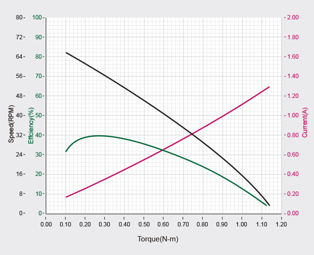

# Weekly Report 2025-07-15: ToddlerBot Simulation

| 항목 | 내용 |
|------|------|
| 작성일 | 2025년 7월 14일 |
| 발표자 | EunwooSong |
| 이메일 | song200348@gmail.com |

---

## 목차

본 리포트는 개요, 문제 정의, Domain Randomization과의 차별점, Servo motor thermal simulation, 구현 방안, 기대효과, 그리고 관련 연구로 구성되어 있다.

---

## 1. 개요

로봇이 특정 태스크를 잘 수행하는 것도 중요하지만, 장기적인 안정성 또한 반드시 고려되어야 한다. 현재의 시뮬레이션 환경에서는 이상적인 모터 상황에 지나치게 과적합되어 있는 문제가 있다. 누적된 사용으로 인한 발열과 이로 인한 모터의 토크 감소를 시뮬레이션하면 sim-to-real gap을 줄이는 데 유용할 것으로 판단된다. 추가로 로봇의 에너지 효율성을 개선할 수 있을 것으로 기대된다.

### 아이디어

다리를 다친 동물도 절뚝거리며 이동하는 것처럼, 이동에 제약이 있더라도 아프지 않은 쪽의 부위를 활용하여 이동한다. ToddlerBot의 walking RL 정책 실행 시, servo motor의 overload로 인한 토크 감소와 기능 정지로 인해 19분 이후 Fall Count가 증가하는 현상이 관찰되었다. 이에 기능의 문제 없이 더 오래 동작하는 방법을 모색하고, 누적되는 risk에 대응하는 방안을 연구하고자 하였다.

---

## 2. 문제 정의

모터는 지속적인 동작 중 내부 발열이 누적되며, 일정 온도를 초과하면 보호 회로를 통해 토크 출력이 감소하거나 동작이 정지된다. 그러나 일반적인 RL 시뮬레이션 환경에서는 모터의 온도 특성을 반영하지 않고 이상적인 상황을 가정하기 때문에, Sim-to-Real Gap이 시간이 지남에 따라 커진다는 문제점이 있다. 시간이 지남에 따라 넘어지는 횟수가 증가하는 현상이 이를 잘 보여준다.

---

## 3. Domain Randomization과 Thermal-aware Policy Learning 비교

Domain Randomization과 Thermal-aware Policy Learning의 차이점을 다음과 같이 정리하였다.

| 항목 | Domain Randomization | Thermal-aware Policy Learning |
|------|---------------------|------------------------------|
| 목적 | 다양한 환경에 대한 정책 학습 | 과열 상황에 대한 적응하고, 예측하는 정책 학습 |
| 랜덤 대상 | Physics Param(질량, 마찰, 토크 등) | 열 상태, 온도 변화율, 발열 시 제약 조건 |
| 시간 스케일 | 에피소드 초기부터 적용 | 시간 누적에 따른 문제 상황 |
| 정책 반응 | 에피소드 마다 달라지는 환경에 적응 | 열 누적 상황에 따라 행동 조정 |
| 역할 | 환경 불확실성 반영 | 실제 고장 메커니즘(토크 감소, 모터 제한 등) 반영 |
| 보상 설계 | task only | 발열에 대한 보상(발열량이 크면 보상 감소 등) |

### Domain Randomization과의 확장 결합

Domain Randomization과 Thermal-aware Policy Learning을 결합하여 확장하는 방안도 고려할 수 있다. 구체적으로 초기 모터 온도 랜덤화, 냉각 계수 랜덤화(냉각이 잘 안되는 환경 또는 잘 되는 환경), 모터 에너지 효율 랜덤화, 온도에 따른 토크 감소율 랜덤화 등을 적용할 수 있다.

### Algorithm으로 관리하는 것과의 차별점

단순히 특정 이상 온도로 올라가면 동작을 멈추게 할 수 있지만, 냉각이 될 때까지 Agent가 멈춰야 하는 문제점이 있다. 본 연구에서는 overload로 인해 예상한 토크가 부족한 상황을 극복하는 것에 초점을 맞추고 있다.

### 기존의 에너지 효율성 보상 함수

ToddlerBot에서 사용하는 보상 함수는 system 총량을 기준으로 설계되어 있다.

---

## 4. Servo Motor Thermal Simulation

### 모터의 발열량

모터의 발열량은 입력 전력에서 기계적인 출력을 빼어 구한다. 입력 전력과 출력의 차이를 발열로 가정하며, 권선에서 발생하는 열손실이 주를 이룬다. Mujoco에서 Torque와 velocity를 구할 수 있으며, maxon motor의 key information을 참고하였다.

### 입력 전력과 출력 전력

모터의 입력 전력과 출력 전력 관계를 분석하였다.

### 모터의 효율성

모터의 효율성을 분석하기 위해 XC430 spec을 참고하였다.

### 1차 열 모델

모터의 열 특성을 모델링하기 위해 1차 열 모델을 적용하였다.

### 과열로 인한 토크 감소 및 최대 토크 감소

과열 시 토크가 감소하는 현상을 분석하였다. KOLLMORGEN의 derating 자료를 참고하였다.

---

## 5. 구현 방안

### Simple Pipeline

구현을 위한 간단한 파이프라인은 다음과 같이 구성되어 있다. 먼저 Policy step에서 Torque와 angular velocity를 생성한다. 이후 Temperature Step에서 Torque Derating 또는 Motor Shutdown을 수행하며, 이 과정에서 model.actuator_forcerange를 업데이트한다. 최종적으로 MuJoCo Step을 실행한다.

### 1차 열 모델 시뮬레이션 결과 MuJoCo 적용 방안

최대 토크만을 제한하는 방식을 채택하였다. 최대 토크보다 적은 토크는 생성에 문제가 없을 것이라고 가정하였다. 정책에서 생성한 토크 값[-1, 1]을 스케일링하여 실제 출력 토크를 계산한다. Brax 정책에서 생성된 토크 값을 모터의 최대 토크로 역스케일링(normalization)하고, 다시 derating된 값으로 스케일링하여 시뮬레이션을 진행한다.

### Agent 학습 방향

본 연구에서는 과열로 인한 토크 감소에 대응하는 Agent를 학습시키고자 한다. 모터의 실제 효율성을 시뮬레이션에 적용함으로써 sim2real gap을 줄이는 데 도움이 될 것으로 기대된다.

---

## 6. 기대효과

본 연구를 통해 다음과 같은 다양한 Agent를 학습시킬 수 있을 것으로 기대된다.

overload 상황을 학습하여 토크 감소 상황을 극복하는 Agent, 발열 시 냉각하는 방법을 학습하는 Agent, 전력 손실을 최소화하는 Agent, 온도 변화율을 최소화하는 Agent, 누적된 총 열량을 최소화하며 task를 수행하는 Agent, 그리고 주변 온도에 따른 토크 감소에 대응하는 Agent 등이 있다. 특히 제철소나 우주와 같은 극한 환경에서의 적용 가능성도 기대된다.

### 적용 Task 및 성능 비교

ToddlerBot에 있는 정책에서 Thermal-reward를 추가하고, 해당 정책을 반복 수행했을 때 어떤 모델이 더 오래 지속되는지를 타이머로 비교 실험을 수행할 계획이다. 시뮬레이션에서 과열 상황을 부여하고, 각 모델(original과 ours)을 비교하는 방식으로 평가를 진행한다.

---

## 7. 관련 연구

### DreamFLEX: Learning Fault-Aware Quadrupedal Locomotion Controller for Anomaly Situation in Rough Terrains

DreamFLEX는 험지에서의 이상 상황에 대한 결함을 정의하고, 이를 학습하여 sim2real gap을 최소화하는 연구이다. 결함은 크게 두 가지로 정의된다. 첫째, 잠긴 관절은 외부 충격 등으로 인해 특정 관절이 고정되거나 움직임 범위가 제한되는 상황을 의미한다. 둘째, 약화된 모터는 과열, 전력 부족 등으로 특정 관절 모터가 정상적인 토크를 발생시키는 데 제한이 생기는 상황을 의미한다.

*빨간색 원은 결함이 생긴 관절을 의미한다.

### FT-Net: Learning Failure Recovery and Fault-Tolerant Locomotion for Quadruped Robots

FT-Net은 혹독하고 위험한 환경에서 발생할 수 있는 로봇의 내고장성(fault-tolerance)을 고려한 연구이다. FT-Net을 통해 고장 관리를 수행하며, 실제 토크에 고장 계수를 곱하여 토크를 계산하고 이를 시뮬레이션한다. 다양한 고장 상황에서도 보행할 수 있는 범용적인 정책을 학습하는 것이 목표이다.

---

Copyright 2024 Global School of Media
