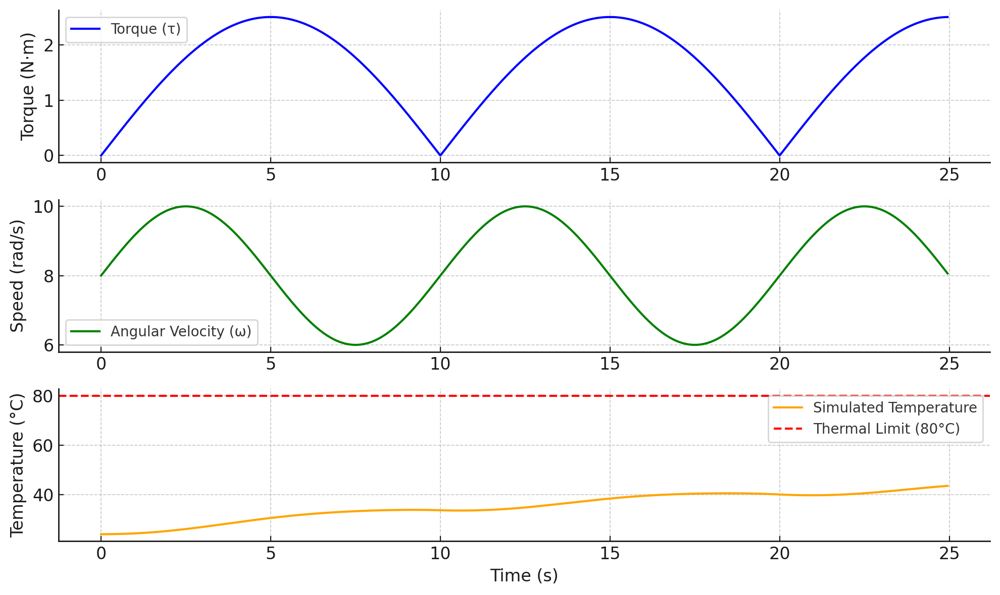

# Weekly Report 2025-07-22

**ToddlerBot Simulation**

| 항목 | 내용 |
|------|------|
| 작성일 | July 22, 2025 |
| 작성자 | EunwooSong |
| 이메일 | song200348@gmail.com |

---

## 진행중

현재 학습 중 발생하는 JAX 누수 문제 해결에 집중하고 있다. 문제가 되는 특정 함수를 특정하였으며, Domain Randomization 관련 함수에서 문제가 발생하는 것으로 확인되었다. 또한 시뮬레이션 함수 테스트를 병행하여 진행하고 있다.

---

## Road Map

본 연구의 전체 로드맵은 다음과 같다.

먼저 시뮬레이션 코드 테스트를 수행한다. 이후 온도 시뮬레이션을 JAX로 구축하고, 이를 시각화하는 작업을 진행한다. 그 다음 모터 온도를 실측하여 시뮬레이션 결과와 비교 검증을 수행한다.

검증이 완료되면 이미 학습된 Agent에 온도 시뮬레이션을 적용하고, 이에 맞는 보상 함수를 구상한다. 이를 바탕으로 학습을 진행하고, 비교 실험을 통해 성능을 검증한다. 최종적으로 다른 논문과의 비교를 통해 연구 결과를 평가할 예정이다.

---

## 시뮬레이션 함수 테스트

시뮬레이션 함수에 대한 테스트를 진행하였다. 아래는 테스트 결과를 보여주는 이미지이다.

---

*Copyright 2024 Global School of Media*
