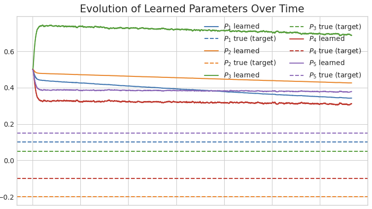
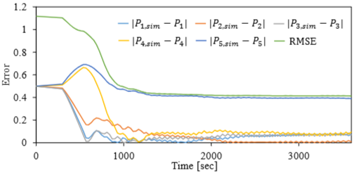

# Weekly Report 2025-10-14

**Toddlerbot Fault Tolerance**

| 항목 | 내용 |
|------|------|
| 작성일 | Oct 14, 2025 |
| 작성자 | EunwooSong |
| 이메일 | song200348@gmail.com |

---

## 개요

본 리포트에서는 Toddlerbot 학습 결과와 Online Learning Estimator Core Model의 진행 상황에 대해 다룬다.

---

## Toddlerbot 학습 결과

### 학습 환경 세팅

본 실험에서는 기존 observation에 권선 온도 값(c_core)을 추가하여 학습 환경을 구성하였다. 이를 통해 권선의 온도만으로 토크 제한을 감지할 수 있는지 검증하고자 하였다.

학습 과정은 두 단계로 나누어 진행하였다. 먼저 토크 제한이 없는 환경에서 30,000,000 스텝 동안 학습을 진행하여 기본적인 보행 능력을 습득하도록 하였다(basic). 이후 토크 제한이 있는 환경에서 10,000,000 스텝 동안 추가 학습을 진행하였다(thermal). 이러한 Curriculum Learning 방식을 통해 로봇이 걷는 방법을 먼저 학습한 다음, 제한된 환경에서 적응할 수 있도록 유도하였다.

### 비교 환경 세팅

공정한 비교를 위해 다음과 같이 실험 환경을 통일하였다. random generate seed를 0으로 고정하였으며, 동일한 Domain Randomization과 Noise가 적용된 환경에서 실험을 진행하였다. 또한 동일한 actuator config를 사용하였고, 각 모델의 best policy를 기준으로 비교하였다. 실험의 목표는 108,000 step(약 30분)까지 생존하는 것으로 설정하였다.

### 실험 결과

실험 결과, basic 모델은 약 31,989 steps(8분 53초)까지 생존한 반면, thermal 모델은 약 13,584 steps(3분 46초)에서 실패하였다.

### 결과 분석

실험 결과를 분석한 결과, thermal 모델에서 몇 가지 문제점이 발견되었다.

첫째, thermal 모델이 비효율적인 전략을 학습한 것으로 나타났다. 구체적으로 무리하게 다리를 움직이려는 시도가 관찰되었으며, 3,945 step부터 토크 제한이 발생하기 시작하였다.

둘째, 원인과 결과 사이의 단절 문제가 확인되었다. 모델이 온도 상승과 토크 제한 간의 관계를 제대로 학습하지 못하였으며, 이는 적절한 보상함수의 부재에서 기인한 것으로 분석된다.

셋째, 단기적 보상에 대한 근시안적 최적화 경향이 나타났다. 모델이 당장 앞의 보상을 최대화하는 것에만 초점을 맞추어, 미래의 큰 손실보다 현재의 작은 이익을 우선시하는 행동 패턴을 보였다.

---

## Online Learning Core Estimator

### Meta Learning

이전에 공부한 내용을 바탕으로 코드를 작성하고 메타 러닝을 진행하였다. 실험의 일관성을 위해 파라미터는 동일하게 설정하였다.

### Meta Learning 결과

아래 이미지는 메타 러닝의 학습 결과를 보여준다.

### Meta Learning 목표

다음 이미지는 메타 러닝이 달성하고자 하는 목표 상태를 나타낸다.

---

## 향후 계획

다음 단계에서는 아래 항목들을 진행할 예정이다.

heat2torque 코드 정리 작업을 수행하고, Online Learning Core Estimator 코드를 수정할 계획이다. 또한 결과의 시각화(Visualization) 작업을 진행하며, Thermal 환경에서 처음부터 학습을 시작했을 때 제대로 학습이 되지 않는 이유에 대한 분석을 수행할 예정이다.

---

*Copyright 2024 Global School of Media*
