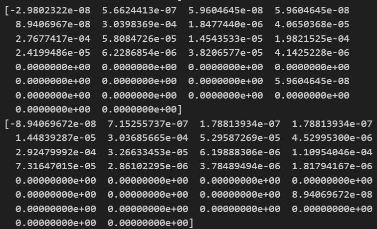

# Weekly Report 2025-11-18

## ToddlerBot Simulation

| 항목 | 내용 |
|------|------|
| 작성일 | 2025년 11월 17일 |
| 발표자 | EunwooSong |
| 이메일 | song200348@gmail.com |

---

## 목차

본 주간 보고서에서는 Reward 2 학습 결과, stress test(high temp.) 및 문제 분석에 대하여 다루고 있다.

---

## Reward 2 결과

### Reward 2, warm up

본 연구에서는 RBF(Radial Basis Function)을 이용한 보상 함수를 설계하였다. 해당 함수는 평균값 μ와 편차 σ를 가지며, v가 μ일 때 최대의 보상을 갖도록 설계되었다. 개별 actuator에 따라 계산을 수행한 후, 평균으로 reward를 계산하는 방식을 적용하였다.

### Reward 2, 실험 환경

실험은 3000 steps로 설정하였으며, 모든 실험은 동일한 환경에서 진행되었다.

### 실험 결과 (19456000 steps)

19456000 steps에서의 학습 결과를 확인하였다.

### 실험 결과 (best-policy)

best-policy에서의 실험 결과를 분석하였다.

### 실험 결과 (19456000 steps, high temperature)

19456000 steps에서 high temperature 조건으로 실험을 수행하였다.

### 실험 결과 (best-policy, high temperature)

best-policy에서 high temperature 조건으로 실험을 진행하였다.

### 추가 실험 결과 (19456000 steps)

19456000 steps에서의 추가 학습 결과를 확인하였다.

### 추가 실험 결과 (best-policy)

best-policy에서의 추가 실험 결과를 분석하였다.

### 실험 결과 (19456000 steps, high temp.)

19456000 steps에서 고온 조건으로 실험을 수행하였다.

### 실험 결과 (best-policy, high temp.)

best-policy에서 고온 조건으로 실험을 진행하였다.

### Conclusion

warm_up 값을 0.05에서 1.0까지 세분화하여 다시 학습을 진행하였다. warm_up이 0.05일 때 목표로 했던 낮은 온도 달성이 가능하였다. basic과 비교했을 때, last checkpoint는 0.36, best는 0.54의 값을 보였다. 기존에 패널티 항만 있었을 때 불가능했던 학습이 가능해진 것을 확인하였다. 향후 두 가지의 최적의 하이퍼 파라미터를 찾는 것이 필요하다.

---

## Stress Test

### 실험 환경

stress test의 실험 환경은 다음과 같이 설정되었다. 초기 시작 온도는 67.8로 설정하였으며, seed는 0을 사용하였다. basic과 warm up 0.05를 비교하는 실험을 수행하였다.

### 실험 결과

19000000 policy와 best policy에 대한 실험 결과를 비교하였다.

---

## 문제 분석

### 문제점

현재 Agent가 처음부터 토크 제한이 적용되는 환경에서 학습할 수 없다는 문제점이 확인되었다.

### 가설 1

첫 번째 가설은 차원이 너무 크고 잡음이 너무 많다는 것이다. 기존 학습에서 obs 값으로 들어간 값은 motor pos, vel, torso_euler 등이 있다. 이러한 값들은 매 step마다 유의미하게 변화한다. 하지만 온도 값의 경우 유의미하게 변화하는 데이터는 많지 않다. Walk의 경우 leg actuator의 정보만 유의미하게 변화한다. 또한 온도 값은 선형적으로 변화하는 특성을 가지고 있다.

### 가설 1에 대한 TODO

첫 번째로, Agent의 obs로 온도 값이 없더라도 외란에 대응할 수 있는지 확인이 필요하다. 이를 위해 이전 obs와 토크 제한 환경에서의 학습을 진행할 예정이다.

두 번째로, 차원이 크다면 온도 정보를 각 파트별(팔1, 2, 다리 1, 2)로 평균온도와 편차로 obs 값을 제공하는 방안을 검토하고 있다. 온도 값을 leg, arm 등 mask를 씌워 평균온도와 편차를 계산한 후 obs를 제공할 계획이다.

세 번째로, Encoder를 활용한 방안도 고려하고 있다.

### 가설 2

두 번째 가설은 토크 제한 환경이 복잡하다는 것이다. 온도 데이터가 추가된 obs에서도 잘 학습하는 것을 확인할 수 있었다. 이때 온도 데이터는 관측만 하고 제한은 없는 상태였다. 다만 토크 제한 환경에서 정책이 무너지는 모습을 볼 수 있었다.

이에 따라 실제 토크에 따른 제한을 적용하는 것이 아닌, 계산된 토크에서 penalty를 부여하는 방식으로 mismatch를 줄일 수 있는지 검토가 필요하다. 이를 통해 처음부터 학습이 가능한지 확인할 예정이다.

### 가설 정리

개별 실험 방안은 두 가지로 나뉜다.

첫 번째는 토크 제한 환경에서의 실험이다. 기존 Obs와 토크 제한 환경, 30에서 15개로 차원 축소한 Obs와 토크 제한 환경, RNN Encoder를 결합한 Obs와 토크 제한 환경에서 각각 실험을 진행할 계획이다.

두 번째는 기본 환경에서의 실험이다. 기존 Obs에 Thermal 항을 추가하여 실험을 진행할 예정이다.

---

## TODO

향후 진행할 작업은 다음과 같다. 첫째, 가설에 대한 실험을 수행할 것이다. 둘째, ToddlerBot Dynamixel Controller에 온도 정보를 받도록 수정할 계획이다. 셋째, Method에 대한 고민을 진행할 예정이다.

---

Copyright 2024 Global School of Media
