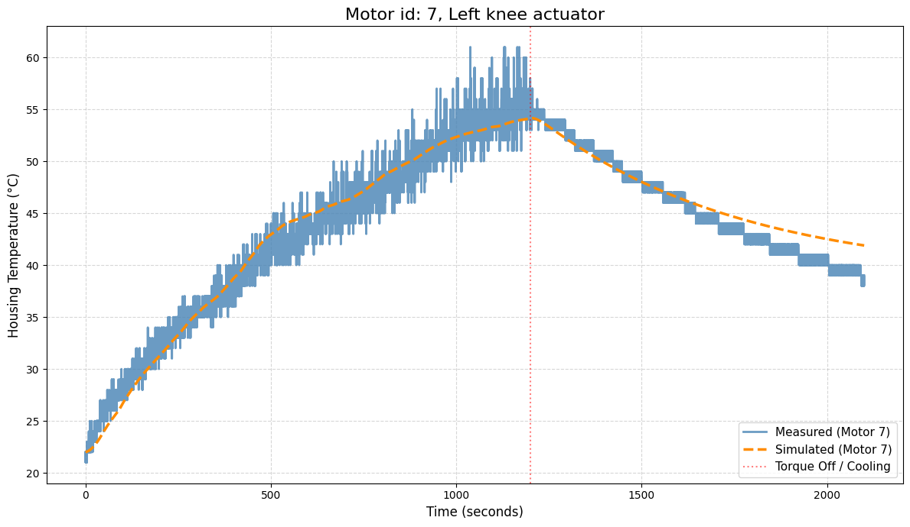
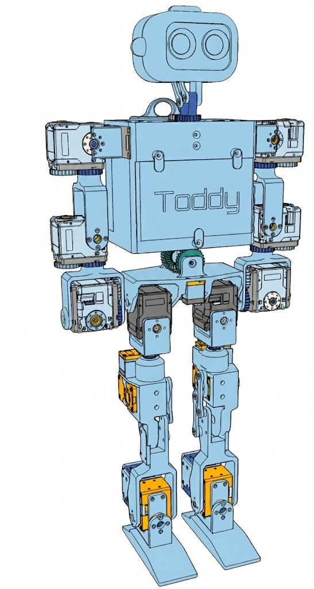

# Weekly Report 2026-01-15

## ToddlerBot Simulation

| 항목 | 내용 |
|------|------|
| 작성일 | 2026년 1월 14일 |
| 발표자 | EunwooSong |
| 이메일 | song200348@gmail.com |

---

## 목차

본 리포트에서는 Toddlerbot의 Thermal Weight에 대해 다룬다. 주요 내용으로는 모터에서 온도 정보를 측정하고, 파라미터 피팅 후 결과를 확인하는 과정이 포함되어 있다. 최종 학습 환경에서는 step의 수에 따라 선형적으로 모터 초기 온도가 높아지게 설정하였으며, 주변 온도의 경우에도 커지도록 구성하였다. 이후 실험 결과를 분석하였다.

---

## Toddlerbot Thermal Weight

### Overview

본 연구에서는 Data Sheet로 구할 수 없었던 열 저항과 열 용량에 대한 파라미터를 추출하였다. 열 저항은 물체 내에서 열의 흐름을 방해하는 정도를 의미하며, 열 용량은 물체가 에너지를 머금는 능력을 나타낸다.

임의의 값으로 시뮬레이션을 수행한 결과, 정확하지 않은 것으로 확인되었다.

### Data Preparation

Walk Policy를 이용하여 가열 구간과 냉각 구간의 데이터를 수집하였다.

실험 시나리오는 다음과 같이 구성되었다. Heat-up Phase에서는 Walk policy를 20분간 실행하였으며, Cool-down Phase에서는 Torque를 비활성화하고 15분간 관측을 수행하였다.

관측 조건은 다음과 같다. 주기는 50Hz(dt = 0.02)로 설정하였으며, 전류는 mA 단위의 float 형식으로, 하우징 온도는 섭씨 단위의 int 형식으로 측정하였다.

### Issue

연구 과정에서 여러 가지 이슈가 발생하였다. 첫째로, Dynamixel 송수신간 지연이 발생하여 패킷 누락이 발생하였다. 모터 온도를 받아온 다음 바로 위치, 각속도, 전류를 받아오고자 할 때 지연이 발생하였다. 이 문제는 모터의 Indirect Address 기능과 sync read 기능을 이용하여 해결하였다.

둘째로, Toddlerbot의 모터 과열과 외란(로프)으로 인하여 오랜 시간 걸을 수 없었다. 이로 인해 손으로 잡아서 측정하는 방식을 사용하였다.

셋째로, 피팅 결과 발산하는 경향이 발생하였다. 이는 Torque Enable 시 회로에서 발생하는 발열 또한 고려해야 하기 때문이었다. 이 문제는 P_base 항을 추가하여 해결하였다.

### Indirect Address

Indirect Address는 서로 떨어져 있는 컨트롤 테이블의 Address를 연속된 Address로 사용하기 위한 기능이다.

연속된 Address의 장점은 Instruction Packet의 효율성을 향상시킨다는 점이다. SIMD처럼 하나의 명령어로 연속된 메모리의 읽기와 쓰기가 가능해진다.

Sync Read와 Write는 동일한 Address에서 동일한 길이의 데이터를 한 번에 읽기 위한 명령어이다.

예를 들어, 30개의 모터에 대해 LED 조작과 온도 정보를 Read해야 하는 경우를 고려해 볼 수 있다. Motor Control Table에서 Motor Indirect Area로 mapping을 수행한 후, sync_read(ids, 224, 2) 명령어를 통해 30개 모터에 대해 동시에 Read와 Write를 수행할 수 있다.

---

## 2-Resistor Thermal Model

### Optimization

최적화 과정에서는 실제 측정된 하우징 온도와 2저항 열 모델에서 계산된 온도 사이의 MSE를 사용하였다.

Adam Optimizer를 사용하여 학습을 수행하였다. 모든 파라미터가 항상 양수가 되도록 로그 스케일에서 학습을 진행하였다.

### Results

피팅 결과는 다음과 같다.

### Results - Real Time

실시간 측정 결과는 다음과 같이 확인되었다.

### Limitation

본 모델의 한계점으로는 세 가지가 확인되었다. 첫째, 관측값이 int 형식이라는 점이다. 둘째, 2축 모델의 경우 정확한 모델링이 어렵다는 점이다. 셋째, 주변 온도가 크게 영향을 미친다는 점이다.

### Limitation (2축 모델 측정 결과)

2축 모델의 측정 결과는 다음과 같다.

---

## 다른 Policy

### Overview

다양한 Policy에 대한 실험을 수행하였다.

---

## 실험 결과

### Overview

학습된 baseline과 ours policy의 실행 결과를 비교하였다.

ours policy의 경우, 관측값은 baseline과 동일하게 설정하였으며, Torque derating이 적용된 환경에서 실험을 수행하였다.

### Baseline

Baseline 모델의 실험 결과는 다음과 같다.

### Ours - 2

제안하는 방법(ours)의 실험 결과는 다음과 같다.

---

## Overleaf

논문 작성을 위한 Overleaf 프로젝트 링크는 다음과 같다: https://www.overleaf.com/project/69480d5df12b74c92a998a73

---

Copyright 2024 Global School of Media
