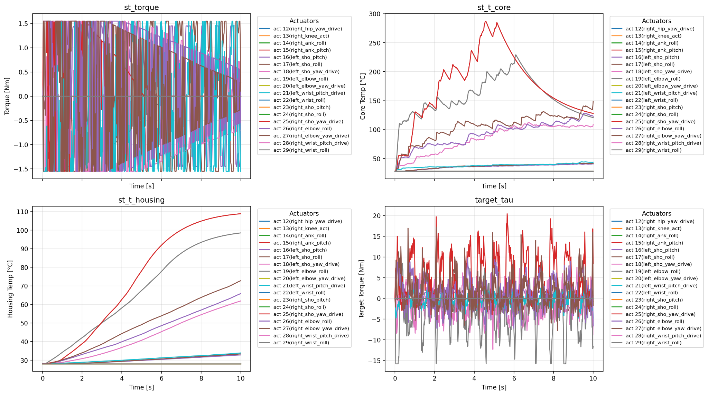
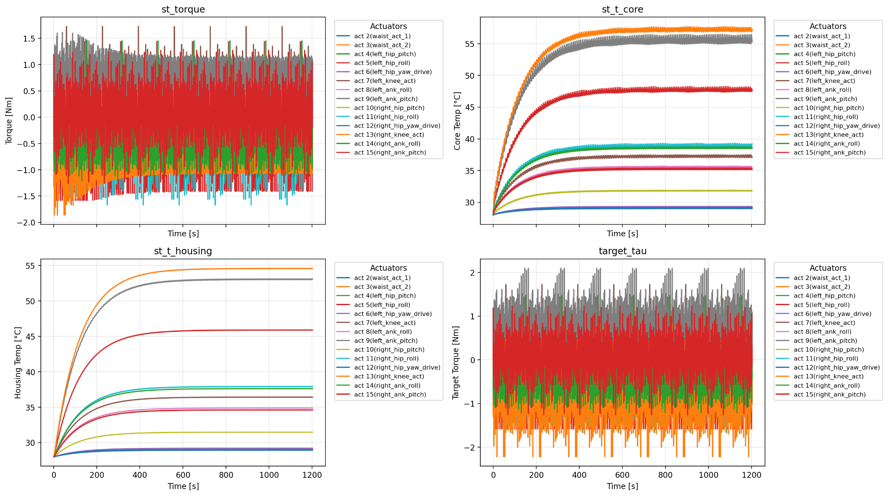

# Weekly Report 2025-08-19

## ToddlerBot Simulation

| 항목 | 내용 |
|------|------|
| 작성일 | 2025년 8월 18일 |
| 발표자 | EunwooSong |
| 이메일 | song200348@gmail.com |

---

## 목차

본 주간 리포트에서는 다음과 같은 작업이 완료되었다.

1. JAX 가속 구현
2. mjx_env 통합 작업

---

## 1. heat2torque 모듈

### 1.1 모듈 개요

heat2torque 모듈은 온도에 따른 토크 제한을 시뮬레이션하기 위한 모듈이다. 이전 논문에서 소개된 2차 열 모델(second-order thermal model)을 토크에 맞게 수정한 후 코드를 작성하였다.

향후 진행해야 할 작업(TODO)으로는 MJXEnv와의 통합 및 실측 값 기반으로 상수를 구축하는 것이 남아있다.

### 1.2 모듈 구조

heat2torque 모듈은 다음과 같은 구조로 설계되었다.

**actuator 패키지**는 세 가지 주요 컴포넌트로 구성된다. base 모듈은 액추에이터 구현체로서 온도 계산 처리를 담당한다. sys 모듈은 JAX 코드로 가속화된 액추에이터 코드를 포함한다. config 모듈은 기본 상수 값을 정의한다.

**envs 패키지**는 환경 관련 모듈들을 포함한다. base 모듈은 여러 액추에이터를 관리하는 Env 클래스이다. tjx_env는 JAX 코드로 가속화된 Env이다. mjx_env는 toddlerbot.locomotion.mjx_env를 상속받아 tjx_env를 이식한 모듈이다. walk_env는 heat2torque.envs.mjx_env를 상속받는 walk 환경이다.

**utils 패키지**는 기타 필요한 유틸리티 함수들을 포함한다.

### 1.3 샘플 코드

다음은 heat2torque 모듈의 사용 예시 코드이다.

위 코드에서는 eval_env.sys.mj_model로부터 액추에이터 정보를 가져온 후, generate_basic_actuators 함수를 통해 기본 액추에이터를 생성한다. 이후 ThermalEnv를 초기화하고 actuator_force_array의 각 토크에 대해 thermal_env.step()을 호출하여 열 시뮬레이션을 수행한다.

generate_basic_actuators 함수는 온도(temp), 액추에이터 이름 목록(names), 최대 토크 값(act_tau)을 입력받아 Actuator 객체 리스트를 생성한다. ActuatorConfig에서 정의된 K_t, R_e, c_a, R_1, R_2, c_core, c_housing 등의 상수 값을 사용하여 각 액추에이터를 초기화한다.

### 1.4 실험 결과

heat2torque 모듈의 시뮬레이션 결과를 다양한 시간 스케일에서 분석하였다.

**8초 시뮬레이션 결과**

8초간의 시뮬레이션 결과에서 st_torque 그래프는 각 액추에이터의 토크 출력을 나타낸다. st_t_core 그래프는 코어 온도 변화를 보여주며, 약 28도에서 시작하여 점진적으로 상승하는 경향을 보인다. st_t_housing 그래프는 하우징 온도가 28도에서 약 29.2도까지 상승하는 것을 보여준다. target_tau 그래프는 목표 토크 값을 나타낸다.

**100초 시뮬레이션 결과**

100초간의 시뮬레이션에서는 더 명확한 온도 상승 패턴이 관찰되었다. 코어 온도(st_t_core)는 약 44도까지 상승하였으며, 하우징 온도(st_t_housing)는 약 40도까지 상승하였다. 일부 액추에이터에서 온도가 급격히 상승하는 것을 확인할 수 있다.

**10초 고부하 시뮬레이션 결과**

10초간의 고부하 조건에서 시뮬레이션한 결과, 코어 온도가 300도 이상까지 급격히 상승하는 것이 관찰되었다. 이는 과열 조건에서의 열 모델 동작을 검증하기 위한 테스트로 보인다. 하우징 온도는 약 100도까지 상승하였다.

### 1.5 JAX 코드 속도 비교

JAX로 가속화된 코드(tjx_env)와 기본 Python 코드(base)의 성능을 비교하였다.

비교 결과, base 구현은 약 80초의 소요 시간이 필요한 반면, tjx_env(JAX 가속화 버전)는 거의 0에 가까운 시간이 소요되었다. 이는 JAX를 통한 가속화가 매우 효과적임을 보여준다.

### 1.6 JAX 가속화 시뮬레이션 결과

**8초 JAX 시뮬레이션**

JAX로 가속화된 환경에서 8초간 시뮬레이션을 수행한 결과이다. 토크 출력, 코어 온도, 하우징 온도, 목표 토크가 정상적으로 계산되는 것을 확인하였다. 코어 온도는 28도에서 약 31.5도까지 상승하였고, 하우징 온도는 약 29.8도까지 상승하였다.

**1200초 JAX 시뮬레이션**

JAX 환경에서 1200초(20분)간의 장시간 시뮬레이션을 수행하였다. 코어 온도는 약 100도 이상까지 상승하였으며, 하우징 온도는 약 -30도까지 하강하는 특이한 패턴이 관찰되었다. 이는 열 모델의 파라미터 조정이 필요할 수 있음을 시사한다.

---

## 2. mjx_env 통합

### 2.1 목표

mjx_env 통합 작업의 목표는 heat2torque 모듈을 기존 MJXEnv 환경에 통합하는 것이다.

아키텍처는 다음과 같이 구성된다. policy 네트워크에서 출력된 actuator ctrl command가 MJXEnv의 pipeline_step으로 전달된다. pipeline_step 내에서 limited ctrl이 toddlerbot/mujoco의 MotorController를 거쳐 limited torque로 변환된다. 이 torque 값은 ThermalEnv.step으로 전달되어 각 Actuator에서 열 계산이 수행되고, limited torques가 반환되어 Update State에 반영된다.

### 2.2 완료된 작업

mjx_env 통합을 위해 다음과 같은 작업들이 완료되었다.

brax.base.State에 heat 상태를 정의하였다. JAX에서는 미리 _pyTree가 정의되어야 하므로 이를 고려하여 구현하였다.

pipeline_init 함수에 heat 초기화 로직을 추가하였다. pipeline_step 함수에 heat 업데이트 로직을 추가하였다. thermal record를 외부로 꺼내는 작업을 수행하였다. visualize 함수가 State 값을 받도록 수정하였다. JAX 충돌 문제를 해결하였다.

### 2.3 결과

mjx_env와 heat2torque 모듈의 통합이 완료되어 ToddlerBot 시뮬레이션에서 열 모델이 정상적으로 동작하는 것을 확인하였다.

---

## 3. 발생한 문제점

본 작업을 진행하면서 다음과 같은 문제점들이 발생하였다.

첫째, JAX 충돌 오류가 발생하였다. JAX 라이브러리 간의 버전 호환성 문제로 인해 충돌이 발생하였으며, 이를 해결하기 위한 디버깅 작업이 필요하였다.

둘째, shape 오류가 발생하였다. JAX의 정적 shape 요구사항으로 인해 배열 크기 관련 오류가 발생하였다.

셋째, 시간이 너무 오래 소요되는 문제가 있었다. 30 step 실행에 26분이 소요되는 심각한 성능 문제가 발견되었다. 이는 최적화가 필요한 부분으로 확인되었다.

---

Copyright 2024 Global School of Media
