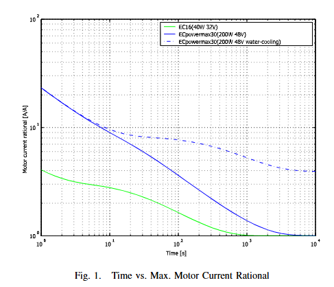
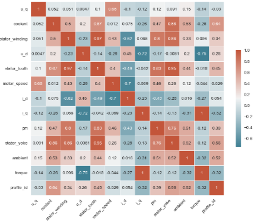

# Weekly Report 2025-08-05

## ToddlerBot Simulation

| 항목 | 내용 |
|------|------|
| 작성일 | Aug 4, 2025 |
| 발표자 | EunwooSong |
| 이메일 | song200348@gmail.com |

---

## Overview

본 보고서는 ToddlerBot 시뮬레이션에 대한 주간 리포트이다. 로봇의 장기 운용 시 발생하는 발열 문제와 이에 대한 대응 방안을 연구한 내용을 담고 있다.

---

## Background

로봇의 장기 운용에서 발열로 인한 성능 저하는 시스템 안정성에 영향을 미친다. 훈련 과정에서 로봇은 항상 이상적인 모터 상황을 가정하고 학습을 진행한다. 이는 고장 상황에 대처하기 어렵고, sim to real gap을 크게 하는 여러 요인 중 하나이다.

시뮬레이션 단계에서 모터의 부하에 따른 발열을 계산하고, 이에 따른 토크 제한을 계산하여 Agent가 Thermal에 따른 토크 제한을 학습함으로써 예측 가능한 고장에 대응하고자 한다. 또한, Agent가 본인의 thermal of actuator를 인식하고 이에 따라 적절한 동작을 수립하도록 하는 것이 목표이다.

---

## Related Work & Limitations

본 연구와 관련된 선행 연구들은 다음과 같다.

DreamFLEX는 험지에서의 이상 상황에 대한 결함 인식 사족보행 로봇 제어기 학습에 관한 연구이다. FT-Net은 사족보행 로봇의 고장 복구 및 내고장성 보행 학습에 관한 연구이다. 고출력 휴머노이드 로봇을 위한 전기 모터의 열 제어에 관한 연구와 딥러닝 알고리즘을 활용한 PMSM 모터의 온도 예측에 관한 연구도 참고하였다.

---

## DreamFLEX: Learning Fault-Aware Quadrupedal Locomotion Controller for Anomaly Situation in Rough Terrains

DreamFLEX 연구에서는 험지에서의 이상 상황에 대한 결함을 다음과 같이 정의하고, 이를 학습하여 sim2real gap을 최소화하였다.

첫째, 잠긴 관절은 외부 충격 등으로 인해 특정 관절이 고정되거나 움직임 범위가 제한되는 현상이다. 둘째, 약화된 모터는 과열, 전력 부족 등으로 특정 관절 모터가 정상적인 토크를 발생시키지 못하는 상태를 의미한다. 아래 그림에서 빨간색 원은 결함이 생긴 관절을 나타낸다.

---

## FT-Net: Learning Failure Recovery and Fault-Tolerant Locomotion for Quadruped Robots

FT-Net 연구에서는 혹독하고 위험한 환경에서 발생할 수 있는 로봇의 내고장성을 고려해야 한다고 주장하였다. FT-Net을 통해 고장을 관리하며, 실제 토크에 고장 계수를 곱하여 토크를 계산하고 이를 시뮬레이션하는 방식을 채택하였다. 다양한 고장 상황에서도 보행할 수 있는 범용적인 정책을 학습하는 것이 해당 연구의 목표이다.

---

## Thermal Control of Electrical Motors for High-Power Humanoid Robots

해당 연구에서는 전기 모터의 최대 성능을 안전하게 활용하기 위해 수냉을 적용하여 안정적으로 활용하는 방법을 제안하였다. 그림에서 파란색 점선은 개조된 모터를 나타내며, 이는 장기적으로 모터를 사용할 수 있다는 것을 의미한다.

센서 정보로부터 모터의 권선 온도와 코어 온도를 계산하며, 모터 온도 계산을 위해 two-resister model을 사용하였다.

---

## Temperature Predictions for PMSM motors using Deep Learning Algorithms

PMSM 모터의 온도 예측을 위해 CNN 모델이 제안되었다. 입력 값으로 주변 온도, 냉각수 온도, 토크, 모터 속도, 전압, 전류, 영구자석 표면 온도를 사용하였다. 해당 모델은 PMSM 고정자, 권선, 요크 등의 온도를 예측한다. 아래 그림은 온도에 영향을 미치는 계수를 시각화한 히트맵이다.

---

## Problem Statement

기존 강화학습 기반 제어는 주로 단기적이거나 예측 불가능한 상황에 대한 대응에 집중되어 있다. 그러나 장기 운용할 경우, 발열 누적에 따른 토크 제한과 성능 저하, 그리고 저항 증가로 인한 전력의 증가 문제 또한 발생한다. 따라서, 안정성을 확보하기 위해 actuator의 발열 특성을 고려한 제어 정책 학습이 필요하다.

---

## Approach - 1

### 발열 시뮬레이션 (Thermal Simulation)

토크, 속도, 주변 온도 등을 통해 모터 온도와 토크 제한 변화를 시뮬레이션한다. 이를 통해 장기 운용에서 누적 발열을 정량화할 수 있는 가상 환경을 제공한다.

### Thermal Policy Learning

장기 안정성을 목표로 정책을 학습하며, 보상 함수는 다음과 같은 요소를 고려하여 설계하였다. 장기적 과부하 및 발열 방지, 에너지 효율성, 그리고 기본 작업 수행 성능 유지가 주요 목표이다.

### 성능 검증

시뮬레이션 상에서 발열 누적, 토크 제한 발생률, 안정성 등을 평가한다. 또한 real world Agent 비교 실험을 수행한다.

---

## Approach - 2

### 실시간 발열 인식과 예측

센서와 발열 모델 등을 통해 모터의 현재 발열 상태를 추정한다. 학습된 발열 모델을 통해 모터의 발열을 예측한다.

### 장기 동작 계획

MPC와 RL Planner를 통해 동작을 계획한다. 현재 발열 상태와 예상 발열 증가 등을 고려하여 동작을 계획한다.

### 안정성 보장 정책

계획된 동작을 수행하면서, 발열 한계에 도달할 경우 동작을 조정한다. 토크 스케일링, 궤적 완화, 다른 관절 이용 등의 전략을 수행한다.

---

## Contributions - 1

### 발열 시뮬레이션 환경 구축

모터의 특성을 시뮬레이션하는 가상 환경을 개발하였다. 정책 학습에 발열 정보를 반영하였다.

### 장기 안정성 강화 정책 학습

발열에 따른 보상 함수를 설계하여 RL 기반 장기 안정성 정책을 Agent가 학습하도록 하였다. 장기간 운용 상황에서 열 상태를 인지하고, 토크가 제한되는 상황에서 적절히 대응할 수 있도록 하였다.

### 성능 검증

성능 검증을 통해 sim to real의 gap을 최소화하고 유의미하게 적용 가능함을 확인하였다.

---

## Contributions - 2

### 실시간 발열 인식 및 예측 프레임워크 개발

센서 데이터와 발열 모델을 결합해 모터의 현재 열 상태를 실시간으로 추정하고, 미래 발열 누적을 예측할 수 있는 모델을 구현하였다. 이를 통해 선제적 발열 관리를 위한 기반을 마련하였다.

### 발열 인식을 통한 장기 동작 계획 제안

MPC와 RL Planner를 활용해 발열 상태와 미래 발열을 예측하여 동작을 계획하였다. 장기 운용 중 발생할 수 있는 과열을 사전에 완화하고, 작업 수행과 안정성 간 균형을 유지하도록 설계하였다.

### 장기 운용 안정성 향상

과열로 인한 모터 제한 횟수를 감소시켰다.

---

Copyright 2024 Global School of Media
