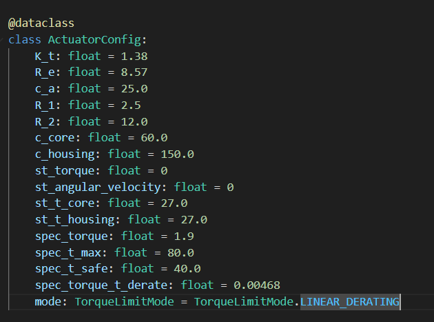
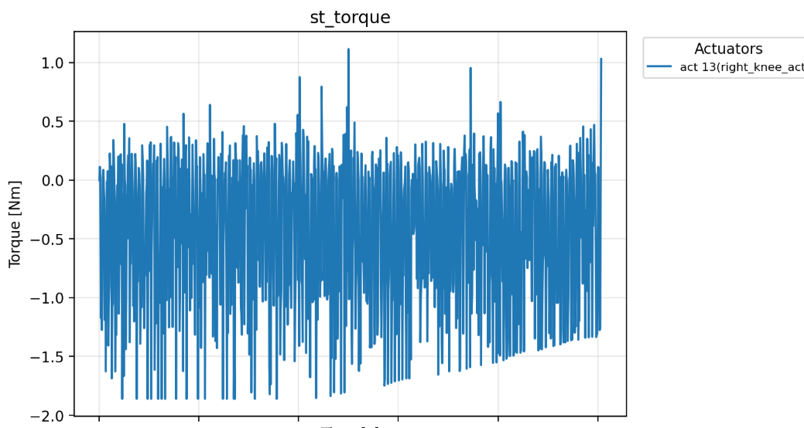
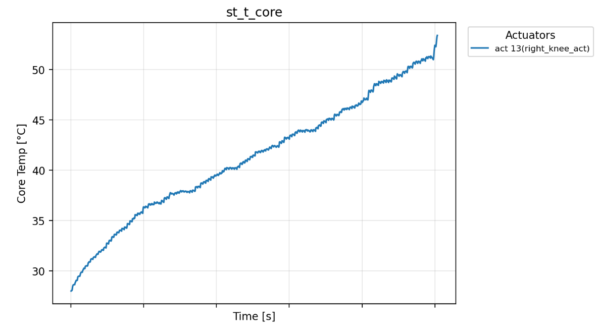

# Weekly Report 2025-09-02: ToddlerBot Simulation

| 항목 | 내용 |
|------|------|
| 작성일 | 2025년 8월 29일 |
| 발표자 | EunwooSong |
| 이메일 | song200348@gmail.com |

---

## 목차

본 주간 리포트에서는 mjx_env를 바탕으로 mjtx_env를 통합한 작업과 그 실행 결과를 확인한 내용을 다루었다.

---

## 1. mjtx_env 오류 수정

### 1.1 완료된 작업

mjtx_env의 오류 수정 작업이 완료되었다. state.info에 연산에 필요한 물리 상수들을 추가하였다. 구체적으로 R_e, c_core, c_housing 등의 상수들이 포함되었다.

jax.lax.scan() 함수의 carry_state와 output을 수정하였으며, pure function으로 구조를 개편하였다. 이를 통해 추론 시간이 오래 걸렸던 오류를 수정하였다. 기존에는 분당 0.2 step의 속도였으나, 수정 후 초당 96 step으로 크게 개선되었다.

향후 개선 방향으로는 heat_state로의 구조 개편이 계획되어 있다.

### 1.2 기존의 오류

기존에 발생하였던 오류 상황은 아래 이미지와 같다.

---

## 2. 실행 결과

### 2.1 1000~1389 Steps 결과

정상 동작(0~500 steps)과 토크 제한 상태(1000~1389 steps)의 결과를 비교 분석하였다.

### 2.2 HeatState 결과

HeatState에 대한 결과는 다음과 같다.

---

## 3. 문제점

현재 구현에서 몇 가지 문제점이 확인되었다.

첫째, 다른 모델에 적용하기 어려운 구조로 되어 있다. 이를 해결하기 위해 pipeline 단에서 동작할 수 있도록 수정이 필요하다.

둘째, 물리 가중치가 완벽하지 않아 Gap이 크게 발생하고 있다. 현재 약 25초 정도 Agent가 실행된 후 과열로 인해 넘어지는 현상이 발생한다.

---

## 4. 적절한 가중치 찾기

적절한 물리 가중치를 찾기 위한 작업이 진행 중이다.

### 4.1 HeatState 결과 분석

가중치 조정에 따른 HeatState 결과는 다음과 같다.

---

## 5. 향후 계획

향후 진행 예정인 작업들은 다음과 같다.

적절한 물리 가중치를 구하는 작업이 필요하다. 이를 위해 실제 모델에서 어떻게 측정할 것인지에 대한 방법론을 수립해야 한다.

모터별 config.json 파일을 생성할 예정이다. 대상 모터는 XC330, 2XC430, XM430, 2XL430이다.

DR(Domain Randomization) 지원을 추가할 계획이다.

Observation 구조를 파악한 이후, st_t_housing 값을 어떻게 입력할 것인지 결정해야 한다. 또한 보상을 어떻게 설정할 것인지에 대한 연구가 필요하다.

마지막으로 다른 Policy 학습 방법에 대한 탐색을 진행할 예정이다.

---

Copyright 2024 Global School of Media
