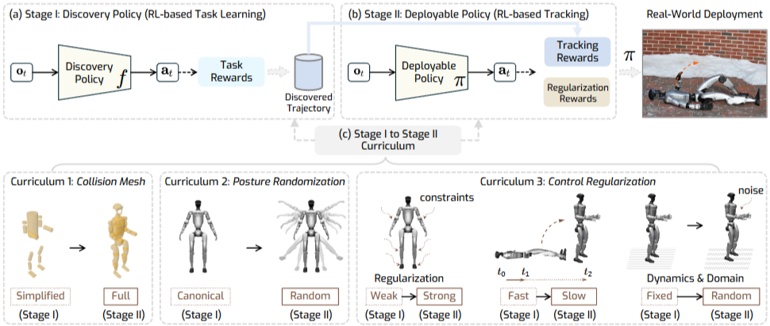
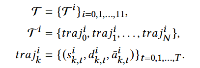
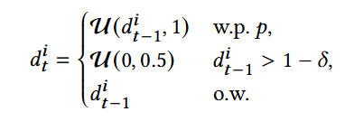
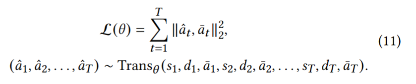
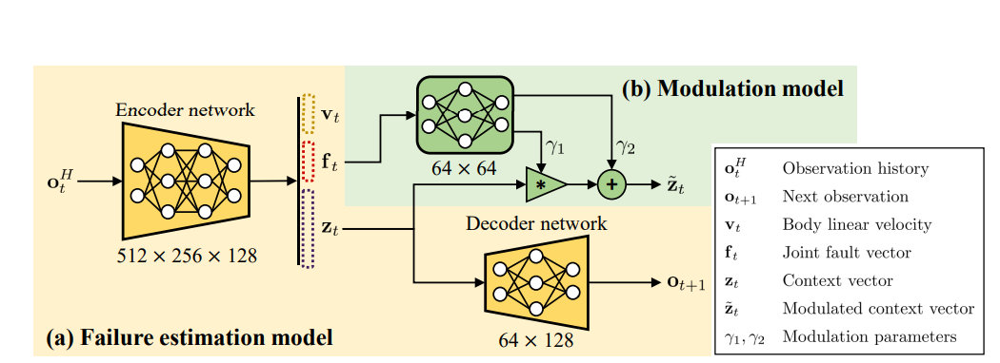
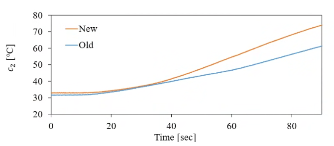
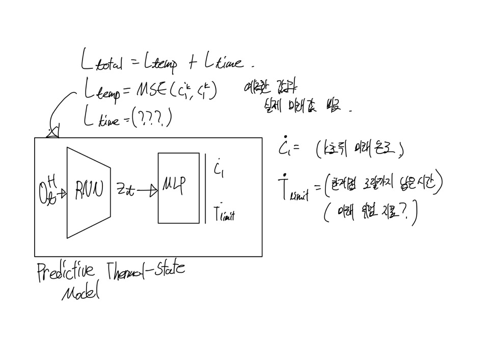

# Weekly Report 2025-09-23

| 항목 | 내용 |
|------|------|
| 작성일 | 2025년 9월 22일 |
| 발표자 | EunwooSong |
| 이메일 | song200348@gmail.com |
| 주제 | Fault tolerance |

---

## 목차

본 보고서는 Fault tolerance에 관한 내용을 다루며, 관련 논문 공유와 연구 방향, 그리고 향후 수행할 작업(TODO)에 대해 서술하였다.

---

## 1. Fault Tolerance

### 1.1 소개

Fault tolerance란 실제 환경에서 자율적으로 장기간 작동하기 위해 예측 불가능한 고장(결함)과 손상에 대처할 수 있도록 Agent를 학습하는 것이다. 시스템의 특정 매개변수가 허용 가능한 값에서 벗어나는 고장에서도 계속 작동하는 능력을 의미한다. 험지, 이물질 등으로 인한 잠김, 약화된 모터 등에 Agent가 대응해야 한다.

### 1.2 FTC (Fault Tolerance Controller)

Fault Tolerance Controller는 크게 두 가지로 분류된다.

첫째, PFTC(Passive FTC)는 설계 초기 단계에서 특정하고 식별된 고장을 처리하도록 미리 설계된 방식이다. 고장에 따라 고정된 제어 로직을 따르는 특징이 있다.

둘째, AFTC(Active FTC)는 시스템 고장에 동적으로 반응하는 시스템이다. PFTC와의 주요 차이점은 시스템 고장에 동적으로 반응하며, 실시간으로 제어 동작을 재구성한다는 것이다.

### 1.3 Fault-Tolerant Quadrupedal Locomotion

4족 보행 로봇에서는 일반적으로 결함을 2가지로 분류한다.

첫째, Locked는 고정된 고장을 의미하며, 여전히 로봇을 지지하는 데 사용될 수 있다. 관절 각도가 잠긴 것이 이에 해당한다.

둘째, Uncontrollable은 고장난 관절이 자유롭게 움직여 제어 기능을 완전히 상실하고, 지지 역할도 할 수 없는 상태이다. 약화된 모터가 이에 해당한다.

### 1.4 연구 분야

본 연구에서는 Agent가 스스로의 발열을 인식하고, 그 발열이 야기할 수 있는 잠재적 고장인 토크 제한에 대해 동적으로 제어 방식을 조정하는 시스템 구축을 목표로 한다. 이는 AFTC에 해당하며, 선제적 건강 및 내구도 관리 방식이다. 기존의 논문들은 결함이 발생한 후의 사후 관리에 해당하지만, 본 연구의 차별점은 예방적 접근 방식을 취한다는 것이다.

---

## 2. 관련 논문 공유

### 2.1 Learning Getting-Up Policies for Real-World Humanoid Robots

#### 2.1.1 Abstract

Automatic fall recovery는 휴머노이드 로봇이 안정적으로 배치되기 위한 중요한 전제 조건이다. 본 논문에서는 다양한 지형에서 다양한 구성을 가진 휴머노이드 로봇이 일어설 수 있도록 하는 컨트롤러를 생성하기 위한 학습 프레임워크를 개발하였다. 다양한 휴머노이드 로봇이 일어설 수 있도록 하는 일반화된 프레임워크를 제공한다. 기존 컨트롤러도 있긴 하지만, 이는 다양한 로봇과 환경에 적용될 수 없으며, 눈 위, 잔디, 경사면 등에서는 정상적으로 동작하지 않는 문제가 있다.

#### 2.1.2 Problems

#### 2.1.3 Method

#### 2.1.4 Method - Discovery Policy Reward Function

#### 2.1.5 Result

---

### 2.2 Dynamic Fall Recovery Control for Legged Robots via Reinforcement Learning

#### 2.2.1 Abstract

다족 보행 로봇은 실제 환경에서 넘어지는 것이 불가피하다. 의도치 않은 종료 없이 넘어짐으로부터 동적으로 회복하는 것이 중요하다. 기존 방식은 복잡한 내외부 접촉 문제를 해결하는 데 어려움을 겪고, 동적으로 회복하기 위한 복잡한 운동 기술을 습득하기 어렵다는 한계가 있다. 본 논문에서는 Learning-based state estimator와 proprioceptive history policy를 결합한 새로운 DRL 프레임워크를 제안하였다. 이를 통해 동적인 넘어짐 회복이 가능하도록 로봇을 훈련시킨다.

#### 2.2.2 Method

#### 2.2.3 Method - Teacher Policy Training

Teacher policy는 무작위로 생성된 지형에서 무작위 교란을 통해 RL로 학습된다. Sim 내부에서 알 수 있는 이상적인 값인 Privileged info에 접근해 실제 로봇이 직면할 수 있는 모든 불확실성에 대처할 수 있도록 학습한다.

#### 2.2.4 Method - State Estimator Training

로봇 상태 변수를 출력하는 state estimator를 학습한다. 학습 데이터는 teacher policy를 이용해 수집한다. Teacher policy를 통해 다음 데이터를 추출한다: o_t(obs)는 proprioceptive obs이며, s_t(ground truth state)는 v_t와 f_t를 기록한다. 여기서 v_t는 실제 선형 속도이고, f_t는 발 접촉 상태이다.

실제 로봇과 동일한 제약 조건을 가지며, Privileged info에 접근할 수 없고, 로봇에 장착된 proprioceptive observations만을 사용한다.

---

### 2.3 Adaptive Control Strategy for Quadruped Robots in Actuator Degradation Scenarios

#### 2.3.1 Abstract

Quadruped 로봇은 극한 환경에 대해 강한 적응성을 가지고 있지만, 결함이 발생할 수 있다. 결함 중 가장 대표적인 것은 장치 노후화 또는 예상치 못한 운영 이벤트와 같은 요인으로 발생하는 액추에이터 손상이다. 본 논문에서는 teacher-student 프레임워크인 Actuator Degradation Adaptation Transformer를 제안하였다.

#### 2.3.2 Preliminaries - Decision Transformer

Attention은 장거리 종속성과 관련성을 캡처해 순차적 의사 결정 문제를 효과적으로 해결한다. 강화 학습(RL) 문제를 조건부 시퀀스 모델링 프레임워크로 추상화한 후, Decision Transformer(DT)를 제안하였다. 자기 회귀 모델을 활용해 DT는 과거 상태-행동 시퀀스 및 예상 수익을 기반으로 행동을 예측한다.

#### 2.3.3 Method - RL

#### 2.3.4 Method - Teacher Policy

12개 actuator 중 하나가 고장된 시나리오를 학습한다. 기존의 expert motion을 모방하는 방식을 사용한다.

#### 2.3.5 Method - Data Collection

데이터 수집 과정에서 p(probability of degradation)는 0.02(2%)로 설정하였다. 손상이 더 진행된다면 이전 손상률보다 더 큰 값으로 균등분포에서 무작위 값을 추출한다. delta(reset threshold)는 0.0001로 설정하였으며, 손상률이 거의 1에 가까워졌을 때 0에서 0.5 값으로 초기화를 진행한다. 해당사항이 없다면 이전 손상률을 동일하게 사용한다.

tau^i는 i번째 actuator가 손상된 시나리오를 의미하며, actuator가 12개이므로 12개의 시나리오를 고려한다. traj^i_n은 i번째 시나리오에서의 n번째 trajectory이며, N은 20000으로 설정하였다. 각각의 trajectory는 상태(s), 손상률(d), 행동 값으로 구성된다. 학습된 teacher policy에서 데이터를 생성한다.

#### 2.3.6 Method - ADAPT Framework

Teacher의 action과 student의 action을 MSE를 이용해 손실을 계산한다. 과거 시퀀스(s, d, a)를 보고 미래의 action을 예측한다. T가 매우 길다면 t값이 커질 수 있기 때문에 입력 시퀀스의 컨텍스트 길이 T_c 내의 상대적인 위치로 제한한다. t는 [0, Tc)의 범위를 가지며, 논문에서는 20으로 제한하였다.

#### 2.3.7 Method - DT (Decision Transformer)

#### 2.3.8 Result & Limitation

본 논문은 제어에 초점을 맞추었기 때문에, 결함을 감지하는 능력(fault detection methods)이 필요하다는 한계가 있다.

---

### 2.4 DreamFLEX: Learning Fault-Aware Quadrupedal Locomotion Controller for Anomaly Situation in Rough Terrains

#### 2.4.1 Abstract

DRL의 발전으로 복잡한 환경에서의 복잡한 동작(낙상 회복, 역동적 움직임 등)이 가능해졌지만, 잠재적인 하드웨어 고장을 고려하지 않고 정상적인 조건만을 가정한다. 모터 과열 또는 갑작스러운 외부 충격으로 인해 발생하는 관절 잠김과 같은 하드웨어 고장이 발생할 수 있다. 본 논문에서는 로봇의 고유 수용성 정보만으로 로봇의 상태(정상 또는 결함)와 고장 지점을 추정하며, 이 정보를 이용해 보행 패턴을 변경한다.

#### 2.4.2 Preliminaries - Actor-Critic

주어진 환경에서 에이전트가 최적의 행동을 선택하는 방법을 학습하며, policy와 value를 동시에 학습하는 형태로 구성되어 있다.

Actor는 에이전트의 행동을 결정하는 policy를 학습한다. 주어진 state에서 어떤 action을 선택해야 할지를 결정한다.

Critic은 주어진 state에서의 가치를 학습한다. 주어진 상태에서의 기대값, 또는 평균적인 보상을 추정하는 함수이다. 선택한 행동의 가치를 평가하고, 이를 통해 행동의 가치를 업데이트한다.

#### 2.4.3 Method - DreamFLEX

#### 2.4.4 Method - FEMNet

#### 2.4.5 Result

---

### 2.5 Estimation and Control of Motor Core Temperature with Online Learning of Thermal Model Parameters

#### 2.5.1 Abstract

로봇의 연속적인 작동을 위해 모터 온도를 정확히 추정하고 관리하기 위한 Thermal Model Parameters를 온라인으로 학습하여 Motor core temperature를 추정하는 방법을 제안하였다. 연산에 사용되는 상수들이 고정된 것이 아닌, 변화하는 환경에 맞춰 온라인으로 parameter를 최신화해 정확한 core-temperature를 예측하고, 이를 이용해 현재 온도에서의 최대 토크 값 내로 움직임을 제한한다.

#### 2.5.2 Two-Resistor Thermal Model (2-저항 열 모델)

열 파라미터의 업데이트 필요성은 다음과 같다. 부착된 금속 부품으로의 열 방출, 주변 온도 오차, 모터의 열화 또는 손상 등이 있다. New와 Old에게 각각 200N의 부하를 걸었을 때 생기는 그래프는 다음과 같다. New는 새로운 모터이고, Old는 오래된 모터로서 90초 이후 15도 차이를 보인다.

#### 2.5.3 Method - B. Proposed Thermal Model

학습을 통해 P1부터 P5까지를 학습하는 것이며, P_i가 0인 것은 기존 2저항 열모델과 동일하다.

#### 2.5.4 Method - C. Thermal Estimator: Estimation of Motor Core Temperature

시간 간격 delta_t_est는 0.02초로 설정하였다.

#### 2.5.5 Method - D. Online Learning of Thermal Model

데이터 수집 시간 간격 delta_t_data는 1.0초로 설정하였다. 시퀀스 길이 N_seq는 30 step이며, 배치 크기 N_batch는 10 sequence로 설정하였다.

#### 2.5.6 Method - E. Anomaly Detection of Motors

#### 2.5.7 Method - F. Thermal Controller: Control of Motor Core Temperature

---

## 3. 연구 방향

### 3.1 Test

#### 3.1.1 Test Environment

Agent obs 값으로 코어 온도만을 추가했을 때, 토크가 제한되는 환경에 대응할 수 있는가에 대한 실험을 수행하였다. 단순 obs에 c_core 값을 추가해 Env에서 학습을 진행하였다. 만약 유의미하다면, 선행연구인 온라인 학습 기반 코어 온도 추정기를 통해 예측한 코어 온도를 관측값으로 넣어주면 잘 동작할 것으로 예상한다.

#### 3.1.2 Limit

Sim2Real Gap이 더 커질 수 있다는 한계가 있다. 온도 시뮬레이션을 신뢰할 수 있는가에 대한 검증이 필요하다. 신뢰할 수 없다면 어떻게 보완할 것인가에 대한 고민이 필요하다. 실제 온라인 학습을 통하면 주변 온도 가중치(P5) 또한 업데이트가 될텐데, 이를 시뮬레이션에서 처리할 수 있는가에 대한 의문이 있다.

### 3.2 Conclusion

#### 3.2.1 Limitations of Prior Research & Our Method

기존의 DRL 기반 제어기들은 예측하지 못한 외란에 대응하는 것에 초점을 맞췄다. 이러한 문제를 해결하기 위해 로봇의 미래 상태를 모터의 온도에 기반해 예측하고, 성능과 하드웨어 내구성 사이의 균형을 맞춘다. 과열에 대한 것도, 과열 상황이 발생한 뒤 생긴 토크 제한에 대응하는 방식이다.

본 연구에서는 선제적 건강 관리 프레임워크를 제안한다. 기존의 고장 후 대응 방식에서 예측 가능한 고장을 미리 예방하는 접근법이다. 2족 보행은 추가로 지지할 수 있는 다리가 없으므로, 선제적으로 대응해주어야 한다.

#### 3.2.2 Reward

기존 Reward에 다음 core temp safe 구역에 따른 보상 함수를 추가한다. 최적온도(c1, min) 이내는 최대 보상을 받으며, 그렇지 않으면 리워드가 점차 감소한다(c1, max). 가우시안 분포 꼴을 이용하며, alpha는 1/sigma^2에 비례한다.

#### 3.2.3 Method

#### 3.2.4 Method - FEMNet

### 3.3 Test Result

#### 3.3.1 Test Environment

Agent obs 값으로 코어 온도만을 추가했을 때, 토크가 제한되는 환경에 대응할 수 있는가에 대한 실험을 수행하였다. 단순 obs에 c_core 값을 추가해 Env에서 학습을 진행하였다.

학습 과정은 다음과 같이 진행되었다. 먼저 토크 제한 없는 환경에서 30,000,000 step을 학습하였으며, C_a는 20에서 28 사이이고 safe_temp는 80으로 설정하였다. 이후 토크 제한 있는 환경에서 10,000,000 step을 추가 학습하였으며, C_a는 38에서 55 사이이고 safe_temp는 45로 설정하였다.

### 3.4 Issue

GPU 2개 장착 이후 하나가 인식되지 않는 문제가 발생하였다. 드라이버 오류였으며, Clean 설치로 해결하였다.

또한 normalization 되지 않은 값을 obs로 넣어주어 학습이 되지 않는 문제가 발생하였다. 100도로 normalization을 진행하여 해결하였다.

---

Copyright 2024 Global School of Media
